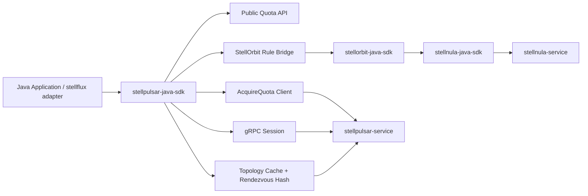
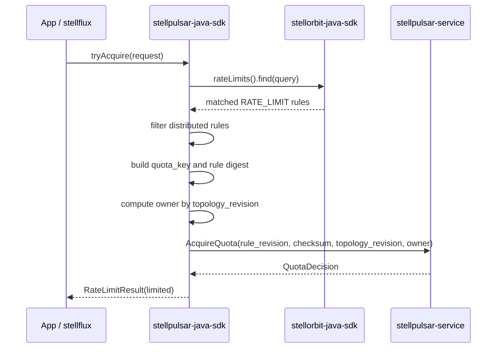

# ADR: StellPulsar Java SDK 客户端架构设计

## 状态

Proposed

## 日期

2026-06-18

## Problem Analysis

`stellpulsar-java-sdk` 是 `stellhub/stellpulsar-service` 的 Java 客户端实现。它面向 Java 应用、网关、平台中间件和后续 `stellflux` 框架集成层，负责在应用侧获取分布式限流规则、连接 StellPulsar 服务端、请求动态配额，并把最终限流结果以稳定 Java API 暴露给上层。

当前上游边界如下：

1. `stellorbit-service` 是治理规则控制面，负责限流规则的保存、校验、发布和回滚。
2. `stellorbit-java-sdk` 是 Java 侧治理规则数据面客户端，已经通过 `stellnula-java-sdk` 消费 `governance/service-governance` 规则通道，并暴露 `RateLimitRuleProvider` 等强类型 Provider。
3. `stellpulsar-service` 是分布式限流配额服务端，通过 gRPC 暴露 `ListInstances`、`OpenSession`、`AcquireQuota`、`GetRuleSnapshot` 和 `ValidateRuleSnapshot` 等协议能力。
4. `distributed-quota-consistency.md` 已经要求客户端必须缓存 topology、按 `rendezvous_hash_v1` 计算 owner、携带 `topology_revision` 和 `target_instance_id`，并处理 `NOT_OWNER`、`SHARD_MIGRATING` 等响应。
5. `stellflux` 框架最终需要把该 SDK 的结果融合进 Spring 拦截器，但当前 SDK 本身不能引入任何 Spring 依赖。

因此，本 SDK 不是简单 HTTP client，也不是本地限流算法库。它的核心职责是：

1. 通过 `stellorbit-java-sdk` 读取当前应用匹配到的限流规则。
2. 从限流规则中过滤出需要 `stellpulsar-service` 执行配额判定的分布式限流规则。
3. 维护 StellPulsar gRPC topology、固定 owner 路由和长连接 session。
4. 调用 `AcquireQuota` 动态计算配额，并处理规则版本、checksum、topology 和 owner 一致性问题。
5. 暴露框架无关的远端配额 API，方便 `stellflux` 在独立 Spring 模块中接入拦截器、Resilience4j 或其他框架侧限流实现。

关键挑战是双数据面一致性：

1. 规则来自 `stellorbit-java-sdk`，配额来自 `stellpulsar-service`，两边都带有 `revision/checksum`。
2. 客户端看到新规则后，服务端可能还未 watch 到同一批规则，需要正确处理 `SERVER_RULE_LAG`。
3. 服务端看到新规则后，客户端本地规则可能落后，需要正确处理 `RULE_STALE`。
4. 多节点部署时，同一个 `application_code + rule_id + quota_key` 必须路由到同一个 owner，否则本地内存桶会跨节点超发。
5. 框架层可能已经存在本地限流、Resilience4j 或拦截器执行模型，核心 SDK 不能重复绑定这些框架语义。

## Design

### 架构决策

SDK 采用“规则数据面 + gRPC 配额数据面 + 框架无关配额 API”的纯 Java 客户端架构：



模块划分如下：

| 模块 | 职责 |
| --- | --- |
| `client` | 生命周期、公共 API、请求上下文、结果模型和关闭资源。 |
| `orbit` | 包装 `stellorbit-java-sdk`，读取 `RateLimitRuleProvider`，过滤分布式限流规则并构建本地不可变规则视图。 |
| `rule` | 将 StellOrbit `RATE_LIMIT` 规则转换成 SDK 内部 `DistributedRateLimitRule`，提取 `rule_id`、`revision`、`checksum`、维度、配额成本、fail policy。 |
| `topology` | 调用 `ListInstances`，缓存 `topology_revision`、实例列表和 `hash_algorithm`，实现 `rendezvous_hash_v1` owner 计算。 |
| `grpc` | 管理 gRPC channel、stub、metadata token、deadline、重试边界和错误映射。 |
| `session` | 维护 `OpenSession` 双向流、hello、heartbeat、rule digest、rule changed、drain 和 topology changed 通知。 |
| `quota` | 构造 `AcquireQuotaRequest`，执行规则一致性和 owner 路由，映射 `QuotaDecision` 到客户端结果。 |

### 核心边界

核心 SDK 必须保持 Spring-free：

1. 不依赖 Spring Boot、Spring Framework、Servlet API、WebFlux、Gateway、Feign 或 Spring Security。
2. 不提供自动装配、拦截器、Filter、AOP 或注解扫描。
3. 只暴露普通 Java API、事件监听和可被 `stellflux` 调用的稳定结果模型。
4. `stellflux` 后续应在自己的 Spring 模块中完成 bean 生命周期、配置绑定和拦截器融合。

核心 SDK 可以依赖：

1. `io.github.stellhub:stellorbit-java-sdk`，用于规则读取和热更新。
2. gRPC Java 运行时，用于连接 `stellpulsar-service`。
3. SLF4J，用于日志门面。

核心 SDK 不依赖 Resilience4j。Resilience4j 适配可以在 `stellflux` 框架层完成，或后续拆成独立的 `stellpulsar-resilience4j-adapter` 可选模块。

### 规则来源与分布式规则过滤

SDK 不直接调用 `stellorbit-service` 管理 API，也不直接读取 StellNula 配置中心。规则读取统一委托给 `stellorbit-java-sdk`：

```java
StellorbitClient orbitClient = new DefaultStellorbitClient(orbitOptions);
orbitClient.start();
List<GovernanceRule> rules = orbitClient.rateLimits().find(query);
```

分布式限流规则过滤条件：

1. `ruleType` 必须是 `RATE_LIMIT`。
2. `status` 必须是 `ACTIVE`。
3. 规则内容必须声明由 StellPulsar 执行分布式配额，推荐规范字段为 `content.limit.mode = "DISTRIBUTED"` 或 `content.limit.backend = "stellpulsar"`。
4. 规则必须包含可传给服务端的 `rule_id`、`revision`、`checksum`、`schema_version`、`quota`、`window`、`dimensions` 和 `fail_policy`。
5. 缺少 `revision/checksum` 的分布式规则不能参与远端扣减，SDK 应按 fail policy 返回降级结果，并记录告警。

内部规则模型建议：

```text
DistributedRateLimitRule
  application_code
  rule_id
  rule_name
  revision
  checksum
  schema_version
  algorithm
  quota
  window_seconds
  burst
  dimensions
  cost_expression
  fail_policy
  attributes
```

如果同一个请求匹配多条分布式限流规则，默认执行全部规则，任意一条返回 `DENIED` 即认为请求被限流；全部返回 `ALLOWED` 才认为请求可放行。规则执行顺序沿用 `stellorbit-java-sdk` Provider 的排序结果，即优先级升序、revision 降序、rule id 升序。

### 公共 API

SDK 需要提供一个面向上层框架稳定调用的 API，而不是暴露 gRPC proto 细节。

```java
public interface StellpulsarClient extends AutoCloseable {

    void start();

    RateLimitResult tryAcquire(RateLimitRequest request);

    default boolean isLimited(RateLimitRequest request) {
        return !tryAcquire(request).permitted();
    }

    @Override
    void close();
}
```

`RateLimitRequest` 由上层传入应用、目标服务、资源、租户、用户、业务维度和 attribute：

```text
RateLimitRequest
  request_id
  application_code
  target_service
  resource
  tenant_id
  user_id
  quota_key
  cost
  attributes
```

`RateLimitResult` 屏蔽协议细节，但保留诊断字段：

```text
RateLimitResult
  permitted
  limited
  decision
  rule_id
  rule_revision
  rule_checksum
  remaining
  reset_at_unix_ms
  retry_after_ms
  reason
  fallback
  error_code
```

`tryAcquire` 这个命名强调该调用可能触发远端配额扣减，不是只读校验。`permitted=true` 表示上层可以继续执行业务逻辑；`limited=true` 表示上层应拒绝当前请求。`fallback=true` 表示结果来自 fail policy，而不是一次完整的远端配额判定。

### gRPC 交互

SDK 使用服务端 ADR 中定义的协议基线：

1. `ListInstances`：启动时和 topology 过期时刷新实例列表。
2. `OpenSession`：建立固定长连接，上报 SDK 信息、规则 digest 和心跳，接收规则变更、drain、topology changed 等通知。
3. `AcquireQuota`：按规则和 quota key 请求配额。
4. `GetRuleSnapshot` / `ValidateRuleSnapshot`：在规则 checksum 冲突或诊断模式下对齐规则内容。

一次配额请求流程：



`AcquireQuotaRequest` 必须携带：

1. `request_id`
2. `application_code`
3. `client_id`
4. `rule_id`
5. `quota_key`
6. `cost`
7. `rule_revision`
8. `rule_checksum`
9. `attributes`
10. `topology_revision`
11. `target_instance_id`
12. `shard_hash`

SDK 必须按以下顺序处理服务端响应：

| Decision | 客户端行为 |
| --- | --- |
| `ALLOWED` | 当前规则放行，继续检查下一条规则。 |
| `DENIED` | 立即返回 `limited=true`。 |
| `INVALID_REQUEST` | 不重试，按规则 fail policy 降级。 |
| `RULE_STALE` | 触发 StellOrbit 规则刷新或等待本地 watch 更新后有限重试。 |
| `SERVER_RULE_LAG` | 按 `retry_after_ms` 对同一 owner 短暂退避重试。 |
| `RULE_CONFLICT` | 调用 `ValidateRuleSnapshot` 或刷新规则，仍冲突时按 fail policy 降级。 |
| `RULE_NOT_FOUND` | 按规则 fail policy 降级，并记录规则传播告警。 |
| `NOT_OWNER` | 使用响应中的 owner 重试，必要时刷新 topology。 |
| `SHARD_MIGRATING` | 按 `retry_after_ms` 重试，不随机切换节点。 |

### Topology 与 owner 计算

SDK 必须实现 `distributed-quota-consistency.md` 定义的 `local-owner-single-writer` 契约。

`ListInstancesResponse.instance_revision` 在 SDK 内部统一命名为 `topology_revision`。客户端 owner 计算输入：

```text
shard_key = application_code + ":" + rule_id + ":" + quota_key
hash_input = topology_revision + "\n" + shard_key + "\n" + instance_id
```

默认算法：

```text
rendezvous_hash_v1
```

实现要求：

1. 字符串统一使用 UTF-8 编码。
2. `hash_algorithm` 必须来自服务端响应；不支持的算法不能进入远端扣减。
3. 只在 `state=UP` 的实例集合中计算新 owner；`DRAINING`、`MIGRATING` 实例可继续出现在拓扑诊断中，但不参与新 owner 选择。
4. 权重小于等于 0 时按 100 处理。
5. 每次请求都携带 SDK 使用的 `topology_revision` 和 `target_instance_id`。
6. 收到 `NOT_OWNER` 且响应未给出 `owner_instance` 时，必须刷新 topology 并重新计算 owner，避免在旧 owner 上无限重试。

### Session 与热更新

SDK 启动后应尽快建立 `OpenSession` 双向流。该长连接不是配额请求的唯一通道，但用于降低规则和 topology 变更感知延迟。

客户端 hello 内容：

```text
protocol_version
sdk_version
application_code
client_id
selected_instance_id
rule_digests
```

长连接处理：

1. 按服务端返回的 `heartbeat_interval_ms` 发送心跳。
2. 本地分布式规则视图变化后，上报新的 `rule_digests`。
3. 收到 `ServerRuleChanged` 后，触发 StellOrbit 规则刷新或等待本地 Provider 热更新，并在下一次请求中携带新 digest。
4. 收到 `ServerDrain` 后，刷新 topology 并在 deadline 前迁移到新 owner。
5. stream 断开时按退避重连，配额请求仍可通过 unary `AcquireQuota` 继续执行。

### 框架适配边界

核心 SDK 只回答“远端分布式配额是否允许本次请求”。`stellflux` 或其他框架适配层负责把结果映射为拦截器行为、HTTP 429、异常、业务 fallback、Resilience4j 事件或本地限流组合策略。

推荐框架层依赖以下最小 API：

1. `StellpulsarClient.tryAcquire(...)`：尝试获取远端配额。
2. `StellpulsarClient.isLimited(...)`：便捷布尔判断，内部仍调用 `tryAcquire`。
3. `RateLimitResult`：携带 `permitted`、`limited`、`fallback`、`decision`、`retry_after_ms` 等诊断字段。

框架层映射语义：

```text
permitted=true -> 执行业务调用
limited=true -> 拒绝请求、抛出框架异常或返回调用方指定 fallback
fallback=true -> 发送框架侧 fallback event，保留原始 reason
```

事件建议由核心 SDK 以普通 Java listener 暴露，具体指标系统和 Resilience4j 事件由框架层转换：

| 事件 | 触发场景 |
| --- | --- |
| `PERMITTED` | 所有匹配规则均返回 `ALLOWED`。 |
| `REJECTED` | 任意规则返回 `DENIED`。 |
| `FALLBACK_PERMITTED` | 远端不可用且规则 fail-open。 |
| `FALLBACK_REJECTED` | 远端不可用且规则 fail-closed。 |
| `RULE_CONFLICT` | 本地规则与服务端规则 checksum 冲突。 |
| `TOPOLOGY_REDIRECT` | 发生 `NOT_OWNER` redirect。 |

如果后续需要 Resilience4j，可以新增可选 adapter 模块，把 `RateLimitResult` 映射为 `RequestNotPermitted`、Resilience4j event publisher 或 decorator。该适配不进入当前核心 SDK。

### 故障与降级策略

| 场景 | SDK 行为 |
| --- | --- |
| 未匹配到任何分布式限流规则 | 返回 `limited=false`，不访问 StellPulsar。 |
| StellOrbit 未启动或规则不可用 | 如果无 last-known-good，默认 fail-open；已有规则时继续使用 last-known-good。 |
| gRPC channel 不可用 | 按规则 fail policy 降级。 |
| `SERVER_RULE_LAG` | 在最大重试次数内按 `retry_after_ms` 重试同 owner，超限后按 fail policy 降级。 |
| `RULE_STALE` | 尝试刷新规则并重试，超限后按 fail policy 降级。 |
| `RULE_CONFLICT` | 执行校验或刷新，仍冲突时按 fail policy 降级。 |
| topology 为空或 hash 算法不支持 | 不发起远端扣减，按 fail policy 降级。 |
| 连续 `NOT_OWNER` | 刷新 topology 后重试，仍失败则按 fail policy 降级。 |

默认 fail policy：

1. 分布式限流规则显式配置 `fail_policy=FAIL_CLOSED` 时，异常降级为 `limited=true`。
2. 显式配置 `fail_policy=FAIL_OPEN` 时，异常降级为 `limited=false`。
3. 未配置 fail policy 时默认 fail-open，但必须记录 warn 日志和指标。

### 配置项

SDK 配置应聚合 StellOrbit、StellPulsar gRPC 和执行策略：

| 配置项 | 默认值 | 说明 |
| --- | --- | --- |
| `applicationCode` | 必填 | 当前应用编码，对应 StellOrbit 和 StellPulsar 的 `application_code`。 |
| `clientId` | 自动生成 | 当前 JVM 实例 ID。 |
| `namespace` | `default` | StellPulsar 服务发现 namespace。 |
| `stellpulsarServiceName` | `stellpulsar-service` | `ListInstances` 目标服务名。 |
| `apiToken` | 空 | gRPC metadata shared token。 |
| `grpcPlaintext` | `true` | 是否使用明文 gRPC。 |
| `grpcDeadlineMs` | `3000` | 单次 gRPC 调用 deadline。 |
| `topologyTtlMs` | 服务端响应为准 | topology 缓存时间。 |
| `topologyRefreshOnNotOwnerThreshold` | `2` | 连续 owner 错误后强制刷新阈值。 |
| `maxAcquireRetries` | `3` | 单条规则最大配额请求重试次数。 |
| `serverLagRetryAfterMs` | `50` | 服务端未返回 retry_after 时的默认退避。 |
| `sessionEnabled` | `true` | 是否建立 `OpenSession` 长连接。 |
| `orbitOptions` | 必填 | 传给 `stellorbit-java-sdk` 的配置。 |

### 可观测性

核心 SDK 不绑定具体监控系统，但必须提供事件、日志和可选指标回调。

建议指标：

| 指标 | 说明 |
| --- | --- |
| `stellpulsar.client.request.total` | SDK check 请求总数。 |
| `stellpulsar.client.rule.matched` | 匹配到的分布式规则数量。 |
| `stellpulsar.client.quota.decision` | 按 decision 统计的服务端配额结果。 |
| `stellpulsar.client.fallback.total` | 按 fail policy 统计的降级次数。 |
| `stellpulsar.client.grpc.latency` | gRPC 调用耗时。 |
| `stellpulsar.client.topology.refresh.total` | topology 刷新次数。 |
| `stellpulsar.client.topology.redirect.total` | `NOT_OWNER` redirect 次数。 |
| `stellpulsar.client.session.active` | session 是否存活。 |

日志字段：

```text
request_id
application_code
client_id
rule_id
rule_revision
rule_checksum
topology_revision
target_instance_id
owner_instance_id
decision
fallback
```

日志中不能打印完整 `quota_key` 明文；如需诊断，只打印 hash 或脱敏值。

### 安全边界

1. gRPC shared token 通过 metadata 传递，日志中必须脱敏。
2. SDK 本地 last-known-good 规则快照可能包含业务治理信息，默认应复用 `stellorbit-java-sdk` 的快照策略，并提醒调用方控制目录权限。
3. `quota_key`、用户 ID、租户 ID 等业务身份字段必须允许调用方选择 hash 或脱敏传输。
4. 核心 SDK 不负责认证授权决策；认证授权由上层应用、服务网格或 `stellflux` 相关模块处理。

## Implementation

建议落地顺序：

1. 调整 Maven 依赖，引入 `stellorbit-java-sdk`、gRPC Java、protobuf 插件和 SLF4J，保持无 Spring 与 Resilience4j 依赖。
2. 新增 `src/main/proto/stellpulsar/v1/stellpulsar.proto`，与服务端 ADR 的协议字段保持兼容，并包含 topology 扩展字段。
3. 生成 Java gRPC stub，封装到内部 `grpc` 包，避免公共 API 直接暴露 proto 类型。
4. 新增 `StellpulsarClientOptions`，聚合应用标识、StellOrbit options、gRPC endpoint/token、topology 和重试配置。
5. 新增 `DefaultStellpulsarClient`，实现 `start()`、`tryAcquire()` 和 `close()` 生命周期。
6. 新增 `StellorbitRuleBridge`，包装 `StellorbitClient`，读取 `RateLimitRuleProvider`，过滤并转换 `DistributedRateLimitRule`。
7. 新增 `TopologyManager`，实现 `ListInstances`、topology cache、`rendezvous_hash_v1` 和 owner 查询。
8. 新增 `SessionManager`，实现 `OpenSession`、heartbeat、rule digest 上报、drain 和重连。
9. 新增 `QuotaClient`，实现 `AcquireQuota` 调用、decision 映射、规则一致性重试、owner redirect 和 fail policy 降级。
10. 新增 `RateLimitRequest`、`RateLimitResult`、`RateLimitDecision`、`FailPolicy` 等公共模型。
11. 新增普通 Java 事件监听接口，暴露 permitted、rejected、fallback、rule conflict 和 topology redirect 等事件。
12. 增加单元测试覆盖规则过滤、quota key 构造、rendezvous hash、decision 映射、fail-open/fail-closed、`NOT_OWNER` 和 `SERVER_RULE_LAG` 重试。
13. 增加本地集成测试，使用 fake StellOrbit rule provider 和 in-process gRPC server 验证最小闭环。

第一阶段非目标：

1. 不提供 Spring Boot starter。
2. 不实现 Servlet / WebFlux / Gateway 拦截器。
3. 不直接操作 StellOrbit 或 StellNula 控制面。
4. 不在客户端本地实现分布式计数算法。
5. 不绕过 `stellorbit-java-sdk` 直接订阅治理规则。
6. 不宣称多节点强一致；只实现 `local-owner-single-writer` 客户端侧契约。
7. 不在核心 SDK 中引入 Resilience4j；Resilience4j 由 `stellflux` 或独立 adapter 模块接入。

## Complete Code

第一份完整可运行代码应满足以下交付边界：

1. `mvn test` 可以通过。
2. `pom.xml` 不包含任何 Spring 相关依赖。
3. SDK 可以启动 `DefaultStellpulsarClient`，并启动内部 `stellorbit-java-sdk` 规则源。
4. SDK 可以从匹配到的 `RATE_LIMIT` 规则中过滤出分布式限流规则。
5. SDK 可以调用 fake 或真实 `ListInstances` 获取 topology，并按 `rendezvous_hash_v1` 计算 owner。
6. SDK 可以调用 fake 或真实 `AcquireQuota`，把 `ALLOWED` 映射为 `limited=false`，把 `DENIED` 映射为 `limited=true`。
7. SDK 可以处理 `SERVER_RULE_LAG`、`RULE_STALE`、`RULE_CONFLICT`、`NOT_OWNER` 和 `SHARD_MIGRATING` 的最小重试或降级。
8. SDK 暴露 `StellpulsarClient.tryAcquire(...)`、`StellpulsarClient.isLimited(...)`、`RateLimitResult` 和普通 Java 事件监听。
9. 单元测试覆盖规则过滤、owner 计算、decision 映射和 fail policy。

后续 `stellflux` 集成应依赖这些公共 API，而不是直接依赖 SDK 内部 gRPC、topology 或 proto 包。若后续需要调整 proto 字段语义、owner 计算算法、分布式规则过滤谓词或默认 fail policy，必须更新本 ADR。

## 参考

- [stellpulsar-service ADR](https://github.com/stellhub/stellpulsar-service/blob/main/docs/ADR.md)
- [Distributed Quota Consistency Design](https://github.com/stellhub/stellpulsar-service/blob/main/docs/distributed-quota-consistency.md)
- [stellorbit-java-sdk](https://github.com/stellhub/stellorbit-java-sdk)
- [stellorbit-java-sdk ADR](https://github.com/stellhub/stellorbit-java-sdk/blob/main/docs/ADR.md)
